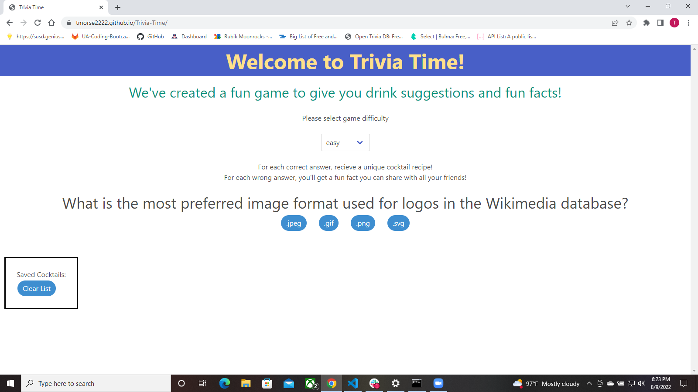

Gregory Ali, James Zagorski, Jean Bissai, Tyler Morse  
Project 1: Trivia Time!

 
User Story: 
AS An adult trivia fan 
I WANT to play a game testing my trivia knowledge 
SO THAT I can have some fun and learn a little 
 

Our first project features the use of Bulma as a CSS framework, as well as fetch requests to opentdb.com to access our trivia questions, thecocktaildb.com to access a random cocktail after answering a question correctly, and api-ninjas.com for our random fact display after answering incorrectly. Both Jquery and vanilla JS are used to create interactivity and make dynamic changes to HTML and CSS. Local storage is accessed to save a cocktail with ingredients and display them in the application upon selection.

A link to the deployed application can be found <a href="https://tmorse2222.github.io/Trivia-Time/">here</a>
